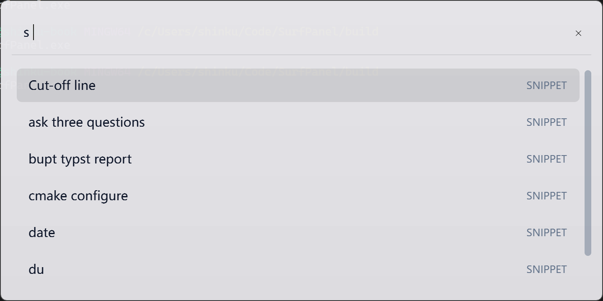

# SurfPanel

SurfPanel is a lightweight desktop command palette for quick access to
bookmarks and text snippets. It runs in the system tray, supports a global
hotkey, and loads items from simple TOML files so you can customize it without
rebuilding.



## Configuration

SurfPanel uses a single main TOML file for everyday configuration. Optional
imports can pull in package files when you want to share or reuse item groups.

### Config Location

SurfPanel searches for the config root in this order:

1. `config/` next to the executable
2. `../config/` relative to the executable, for local debug builds

### Directory Layout

```
config/
	items.toml
	packages/
		<package-name>/
			items.toml
	cache/
		compiled.toml
```

### Main Config

Put your items in `config/items.toml`:

```toml
[[items]]
name = "Open GitHub"
type = "url"
keywords = ["git", "code"]
[items.payload]
url = "https://github.com"
```

Search prefixes are optional. By default, `s ` searches only snippets and
`u ` searches only URLs. Configure `[search.prefixes]` in `config/items.toml`
to change those tokens:

```toml
[search.prefixes]
snippet = "s"
url = "u"
```

### Packages

To import a shared configuration, drop it under `packages/<name>/` and list
its file or directory in `config/items.toml`:

```toml
imports = [
	"packages/my_pack/items.toml"
]
```

Import paths are relative to `config/`. Directories load all `.toml` files in
filename order. Imported items load first, then local `[[items]]` in
`config/items.toml` load after them, so local items can override or disable
package items.

Disable an imported item:

```toml
[[items]]
name = "Docs"
type = "url"
disabled = true
```

Override an imported item:

```toml
[[items]]
name = "Open GitHub"
type = "url"
keywords = ["git", "code"]
[items.payload]
url = "https://example.com/github"
```

If you add an optional `id` field to an item, use the same `id` when
overriding or disabling it later.

### Item Format

URL item:

```toml
[[items]]
name = "Docs"
type = "url"
keywords = ["docs"]
[items.payload]
url = "https://example.com/docs"
```

Snippet item:

```toml
[[items]]
name = "Date"
type = "snippet"
keywords = ["date"]
[items.payload]
snippet = "{{date}}"
```

### Reloading Config

Use the tray menu option **Reload Config** to re-read `config/items.toml` and
its imports without restarting the app.

### Realtime Variables

URL and snippet payloads can include realtime variables. SurfPanel resolves
these when you activate an item, using the local system time:

- `{{date}}`: current date as `yyyy/MM/dd`
- `{{time}}`: current time as `HH:mm:ss`
- `{{datetime}}`: current date and time as `yyyy/MM/dd HH:mm:ss`

Unknown variables are left unchanged.

### Fallback Behavior

If config loading fails, SurfPanel falls back to `cache/compiled.toml` if it
exists. This keeps the app usable after a successful previous load even if the
current config file has syntax errors.

## Open Source Notice

SurfPanel uses the following open-source libraries:

- Qt6 for the application framework and UI.
- [toml11](https://github.com/ToruNiina/toml11) for TOML parsing and configuration loading.
