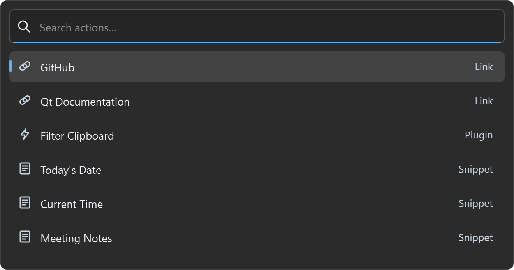

# SurfPanel

[中文](README_zh.md)

SurfPanel is a lightweight desktop command palette that lives in the system tray.
Open it with **Alt+Space** to search bookmarks, insert text snippets, or invoke
plugin functions such as clipboard text cleanup.

- Customize actions and search keywords with TOML; changes reload automatically.
- Use date/time variables in URLs and snippets.
- Normalize PDF clipboard text automatically or on demand.
- Enjoy a compact, system-themed palette with native Acrylic on supported Windows versions.

## Preview

The palette previews show the supported fallback surface; native Acrylic varies
with the desktop background on supported Windows versions.

Dark theme and tray menu

## Getting Started

Launch SurfPanel, press **Alt+Space**, type a name or keyword, and press **Enter**.
Use the arrow keys to select an action and **Esc** to dismiss the palette.
Open the tray menu to access your configuration directory. New installations start
with no actions; add your own using the configuration guide. Saves reload automatically.

## Documentation

- [Configuration guide](docs/configuration.md): actions, imports, search prefixes, variables, and plugin functions.
- [Development guide](docs/development.md): environment, builds, tests, packaging, and UI verification.

## Open Source Notice

Built with C++17 and Qt6 Widgets; TOML parsing is provided by
[toml11](https://github.com/ToruNiina/toml11).
