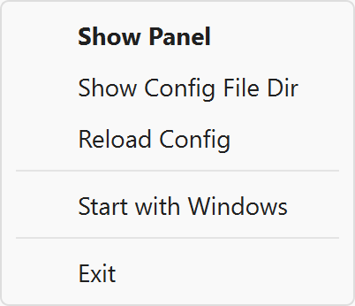

# SurfPanel

[English](README.md)

SurfPanel 是一个常驻系统托盘的轻量级桌面命令面板。
按 **Alt+Space**，即可搜索书签、插入文本片段，或调用剪贴板过滤等插件功能。

- 通过 TOML 自定义条目和搜索关键词，无需重启即可重新加载配置。
- URL 和文本片段支持日期、时间变量。
- 自动或手动清理 PDF 复制文本。
- 紧凑界面跟随系统深浅主题，受支持的 Windows 版本使用原生 Acrylic。

## 界面预览

面板展示图使用受支持的回退外观；原生 Acrylic 在受支持的 Windows 上会随桌面背景变化。

深色主题与托盘菜单

## 快速开始

启动 SurfPanel，按 **Alt+Space**，输入名称或关键词，按 **Enter** 执行。
使用方向键选择条目，按 **Esc** 关闭面板。
通过托盘菜单打开配置目录，修改后选择 **Reload Config**。

## 文档

- [配置指南](docs/configuration_zh.md)：条目、导入、搜索前缀、变量和插件功能。
- [开发指南](docs/development_zh.md)：环境配置、构建、测试、打包和 UI 验证。

## 开源声明

使用 C++17 和 Qt6 Widgets 构建，
由 [toml11](https://github.com/ToruNiina/toml11) 提供 TOML 解析。
